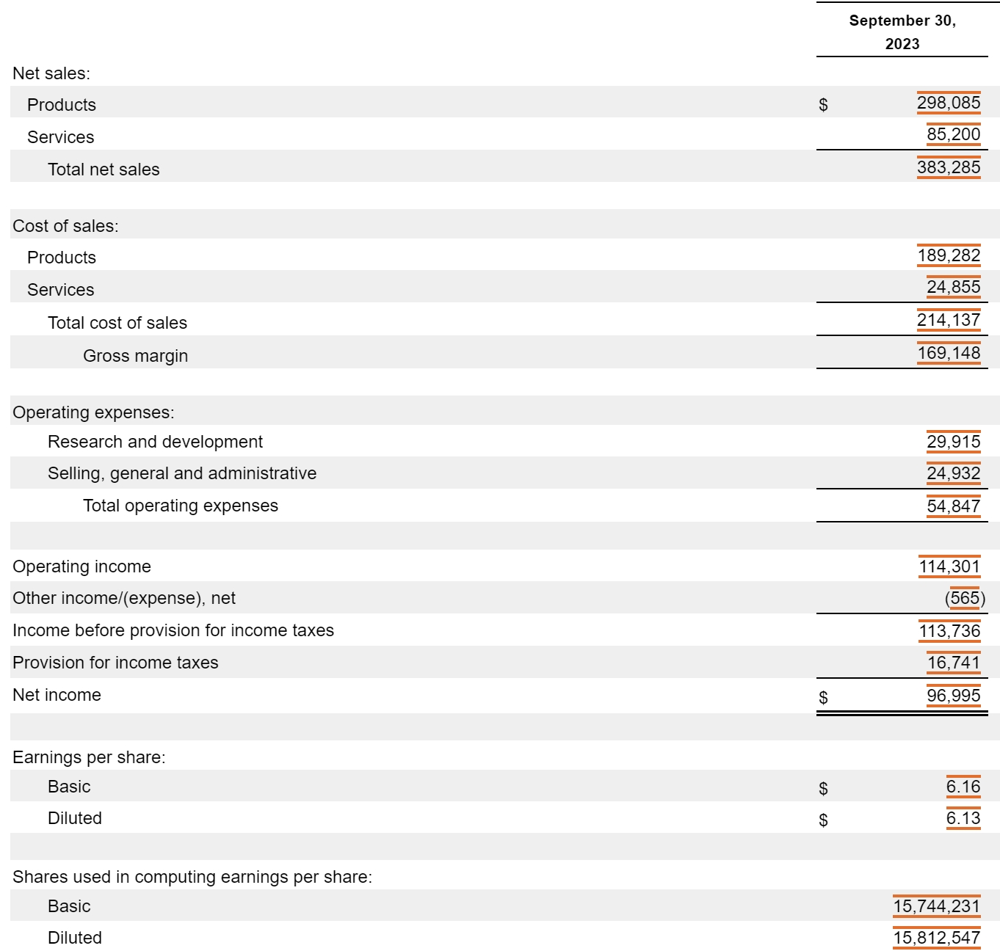
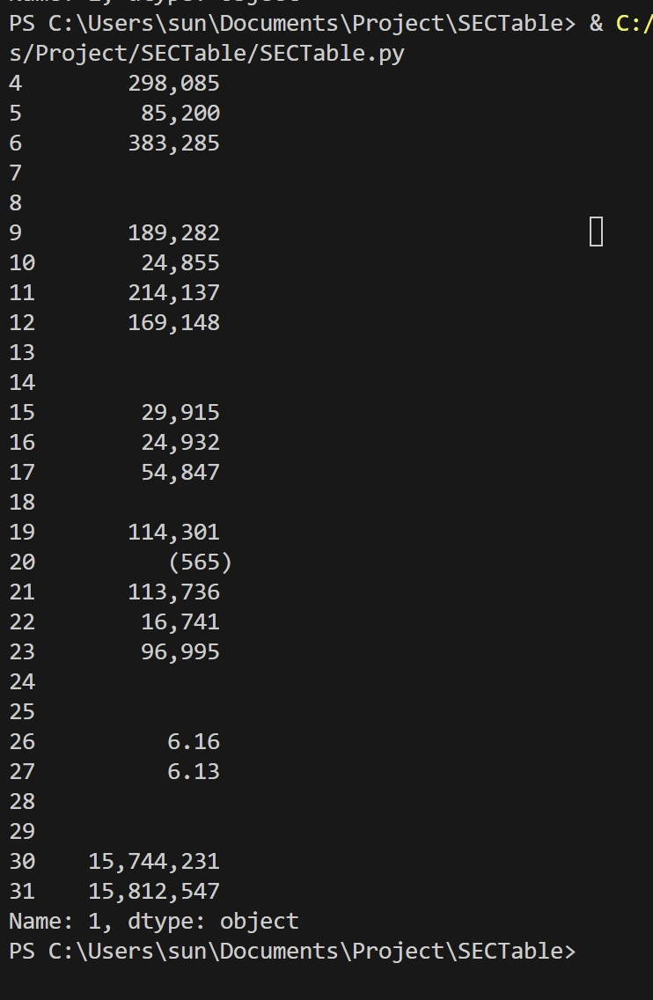
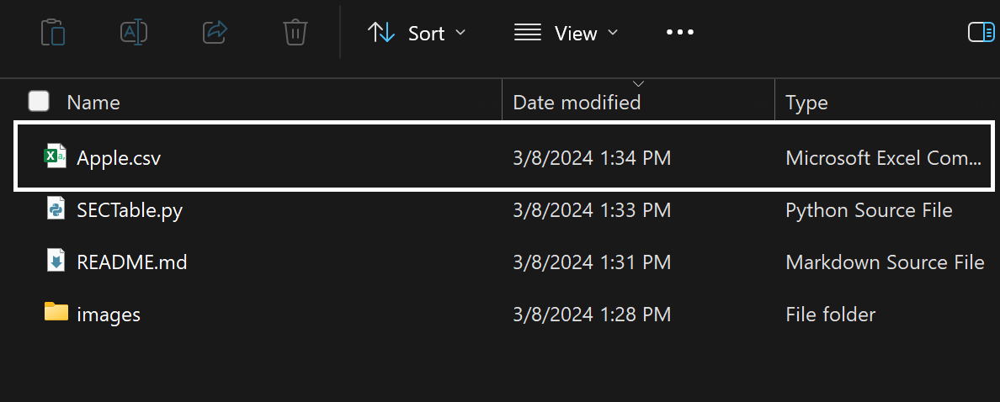

# SECTable

It examines annual reports on sec.gov, extracting financial statements from the most recent year. Subsequently, it stores the extracted data in a CSV file.

### Keywords

[Electronic Data Gathering, Analysis, and Retrieval (EDGAR)](https://www.sec.gov/edgar/about); [Securities and Exchange Comission(SEC)](https://www.sec.gov/); [Web Crawling](https://www.google.com/search?q=Web+Crawling)

### Required Python packages

- [bs4](https://pypi.org/project/beautifulsoup4/) 
- [requests](https://pypi.org/project/requests/)
- [pandas](https://pandas.pydata.org/)

### Parameters
- URL of a firm’s annual report.
  - For example, Apple's annual report is available at https://www.sec.gov/Archives/edgar/data/0000320193/000032019323000106/aapl-20230930.htm 

### Output
1. Show data on the screen.

2. Save them to a CSV file.

### To-do
1. Create a multi-year table.
2. Use ticker instead of URL.
3. Search multiple tickers simultaneously.

